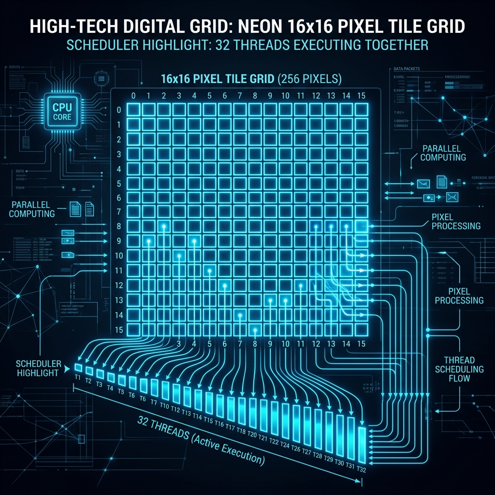
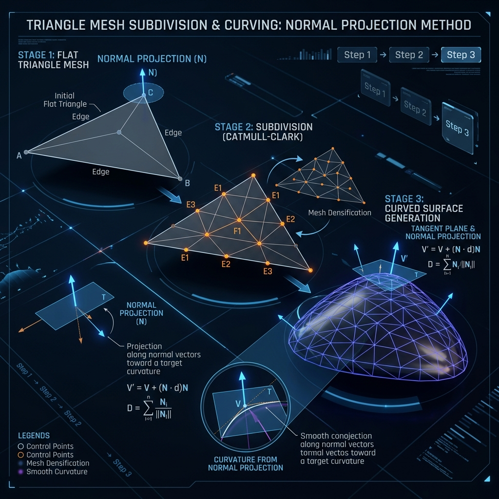
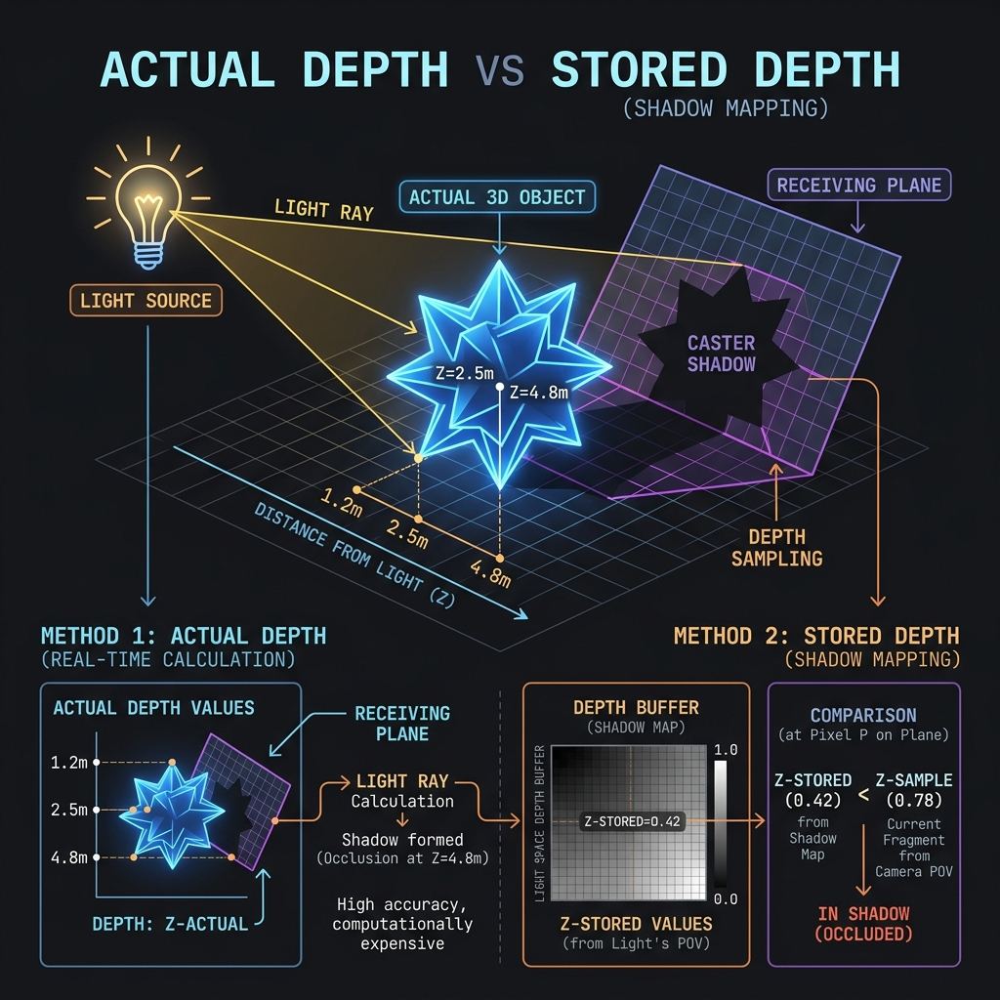

# 13. 1-on-1 Presentation Prep Guide

This guide is designed for your 1-hour 1-on-1 review. It breaks down the four core concepts (Binding, Dispatch, Phong Tessellation, and Shadowmapping) using custom diagrams, detailed code explanations, and direct file/line traces to your project.

---

## 1. Resource Binding & D3D11 Pipeline Hazards

### Visual Introduction


To use any resource (a buffer or a texture) on the GPU, the CPU must assign a **View** to it and bind it to a specific **Register Slot** (e.g., `t0`, `u0`, `cb0`).
* **SRV (Shader Resource View):** Read-only access for shaders (e.g., textures, shadow maps).
* **UAV (Unordered Access View):** Read-and-Write random access (e.g., compute shader output texture, particle buffer).
* **RTV (Render Target View):** Sequential write-only access for drawing pixels.

#### ⚠️ Pipeline Write Hazards
In Direct3D 11, a resource **cannot** be bound as an output (RTV/UAV) and an input (SRV) at the same time. If you do this:
1. The D3D11 runtime will detect a **Read-Write Hazard**.
2. It will print a validation warning in the output log.
3. It will automatically unbind the input slot, replacing your texture with `nullptr` (black texture).

---

### How it is Implemented in your Project
To avoid this hazard in your deferred renderer, you must explicitly unbind the G-Buffer textures from the Output Merger (OM) stage before binding them to the Compute Shader (CS) stage:

```cpp
// 1. Unbind RTVs by passing an array of null pointers to the Output Merger
ID3D11RenderTargetView* nullRTVs[3] = { nullptr, nullptr, nullptr };
context->OMSetRenderTargets(3, nullRTVs, nullptr);

// 2. Now it is safe to bind them as inputs (SRVs) to the Compute Shader
ID3D11ShaderResourceView* srvs[3] = { gbuffer.GetAlbedoSRV(), gbuffer.GetNormalSRV(), gbuffer.GetPositionSRV() };
context->CSSetShaderResources(0, 3, srvs);
```

After the Compute Shader finishes, you perform the reverse operation to clean up slots, preventing hazards on the next frame:
```cpp
// Unbind SRVs and UAVs from the Compute Shader
ID3D11ShaderResourceView* nullSRVs[5] = { nullptr };
context->CSSetShaderResources(0, 5, nullSRVs);
ID3D11UnorderedAccessView* nullUAV = nullptr;
context->CSSetUnorderedAccessViews(0, 1, &nullUAV, nullptr);
```

---

### Where it Happens in the Project
* **Shadow Pass Bindings:** [Main.cpp:L571-580](file:///c:/Users/johan/OneDrive/Desktop/3D-Project-2025/3DProject/RasterizerDemo/RasterizerDemo/Main.cpp#L571-580)
  * Shaders, viewport, and depth views are bound; pixel shader is set to null.
* **Geometry Pass Bindings:** [Main.cpp:L638-658](file:///c:/Users/johan/OneDrive/Desktop/3D-Project-2025/3DProject/RasterizerDemo/RasterizerDemo/Main.cpp#L638-L658)
  * G-Buffer RTVs and tessellation stages are bound.
* **Compute Shader Unbinding & Binding:** [Main.cpp:L846-863](file:///c:/Users/johan/OneDrive/Desktop/3D-Project-2025/3DProject/RasterizerDemo/RasterizerDemo/Main.cpp#L846-L863)
  * G-Buffer RTVs are unbound, and G-Buffer SRVs, shadow map arrays, and UAVs are bound.
* **Compute Shader Cleanup:** [Main.cpp:L866-870](file:///c:/Users/johan/OneDrive/Desktop/3D-Project-2025/3DProject/RasterizerDemo/RasterizerDemo/Main.cpp#L866-870)
  * Bindings are cleared.
* **Vertex Pulling (Buffer-less) Setup:** [ParticleSystemD3D11.cpp:L152-168](file:///c:/Users/johan/OneDrive/Desktop/3D-Project-2025/3DProject/RasterizerDemo/RasterizerDemo/ParticleSystemD3D11.cpp#L152-L168)
  * Vertex buffer set to null; particle structured buffer bound as an SRV to the vertex shader.

---

## 2. Compute Shader Dispatch & Warp Scheduling

### Visual Introduction


Compute Shaders execute in a grid of **Thread Groups**, which contain individual **Threads**.
* **Warps & Wavefronts:** The GPU hardware groups threads in sets of 32 (Nvidia) or 64 (AMD) and executes them in lockstep.
* **Occupancy:** Having group sizes that are multiples of 32 (e.g., 256 or 32 threads) ensures no execution lanes are left idle.
* **Memory Locality:** Processing pixels in a $16 \times 16$ tile layout ensures adjacent threads read adjacent texels, which maximizes texture L1 cache hits.

---

### How it is Implemented in your Project
To launch a compute shader to process every pixel on a $1024 \times 576$ screen, you define the group size in HLSL and compute the grid size in C++:

#### 1. In HLSL: Group Definition
```hlsl
// LightingCS.hlsl
[numthreads(16, 16, 1)] // A 16x16 grid of threads (256 threads total)
```

#### 2. In C++: Grid Calculation (Ceiling Division)
To cover the screen, we divide screen dimensions by the group dimension. We use **ceiling division** `(Size + GroupDim - 1) / GroupDim` to prevent cutting off the edges of the screen:
```cpp
// Main.cpp
context->Dispatch((WIDTH + 15) / 16, (HEIGHT + 15) / 16, 1);
// (1024 + 15)/16 = 64 groups on X
// (576 + 15)/16  = 36 groups on Y
```

#### 3. Out-of-Bounds Guard in HLSL
Since ceiling division rounds up, some threads at the right and bottom edges will process coordinates off-screen. We guard against memory errors:
```hlsl
// LightingCS.hlsl
uint2 pixel = DTid.xy;
if (pixel.x >= width || pixel.y >= height)
    return; // Stop thread execution before performing operations
```

---

### Where it Happens in the Project
* **Lighting Compute Dispatch:** [Main.cpp:L864](file:///c:/Users/johan/OneDrive/Desktop/3D-Project-2025/3DProject/RasterizerDemo/RasterizerDemo/Main.cpp#L864)
  * Triggers the deferred shading lighting pass.
* **Particle Update Dispatch:** [ParticleSystemD3D11.cpp:L115-117](file:///c:/Users/johan/OneDrive/Desktop/3D-Project-2025/3DProject/RasterizerDemo/RasterizerDemo/ParticleSystemD3D11.cpp#L115-L117)
  * Dispatches particle simulation updates using 32 threads per group.
* **Lighting CS Thread Layout & Bounds Check:** [LightingCS.hlsl:L93-102](file:///c:/Users/johan/OneDrive/Desktop/3D-Project-2025/3DProject/RasterizerDemo/RasterizerDemo/LightingCS.hlsl#L93-L102)
* **Particle Update CS Thread Layout & Bounds Check:** [ParticleUpdateCS.hlsl:L60-66](file:///c:/Users/johan/OneDrive/Desktop/3D-Project-2025/3DProject/RasterizerDemo/RasterizerDemo/ParticleUpdateCS.hlsl#L60-L66)

---

## 3. Phong Tessellation & LOD System

### Visual Introduction


Tessellation takes a blocky model and subdivides its triangles dynamically on the GPU.
* **Hull Shader (HS):** Computes tessellation factors (subdivision level) based on distance to the camera.
* **Domain Shader (DS):** Curves the subdivided vertices using the original vertex positions and normal vectors.

#### 🔗 Preventing Edge Cracks
If two neighboring triangles calculate different subdivision levels on their shared boundary, visual holes will open in the model. We solve this by calculating the edge factor using the **midpoint of the shared edge**. Since both triangles share the same edge midpoint, they calculate the exact same subdivision factor, keeping the mesh water-tight.

---

### How it is Implemented in your Project
1. **LOD Midpoint Calculation (Hull Shader):**
```hlsl
// TessellationHS.hlsl
float3 edge0Midpoint = (patch[0].worldPosition + patch[1].worldPosition) * 0.5f;
output.edges[0] = CalculateTessellationFactor(edge0Midpoint);
```

2. **Projecting onto Tangent Planes (Domain Shader):**
For every new vertex coordinate created by the tessellator, we project its flat position onto the tangent plane defined by the three original corner control points:
```hlsl
// TessellationDS.hlsl
float3 ProjectToPlane(float3 position, float3 planePoint, float3 planeNormal)
{
    float3 toPosition = position - planePoint;
    float distanceToPlane = dot(toPosition, planeNormal); // Perpendicular distance
    return position - distanceToPlane * planeNormal;      // Project orthogonally
}
```

We interpolate these three projections using barycentric coordinates $(u, v, w)$ and blend it with the flat triangle position using a blend factor (`PHONG_ALPHA = 0.75`):
```hlsl
float3 phongPosition = projection0 * u + projection1 * v + projection2 * w;
output.worldPosition = lerp(linearPosition, phongPosition, PHONG_ALPHA);
```

---

### Where it Happens in the Project
* **Tessellation Input Topology Setup:** [Main.cpp:L652](file:///c:/Users/johan/OneDrive/Desktop/3D-Project-2025/3DProject/RasterizerDemo/RasterizerDemo/Main.cpp#L652)
  * Sets the topology to `D3D11_PRIMITIVE_TOPOLOGY_3_CONTROL_POINT_PATCHLIST`.
* **Hull Shader Config & LOD Math:** [TessellationHS.hlsl:L39-87](file:///c:/Users/johan/OneDrive/Desktop/3D-Project-2025/3DProject/RasterizerDemo/RasterizerDemo/TessellationHS.hlsl#L39-L87)
  * Computes edge/inside factors and sets up `fractional_odd` partitioning.
* **Domain Shader Smoothing Math:** [TessellationDS.hlsl:L36-82](file:///c:/Users/johan/OneDrive/Desktop/3D-Project-2025/3DProject/RasterizerDemo/RasterizerDemo/TessellationDS.hlsl#L36-L82)
  * Implements point-plane projections and blends them to curve the geometry.

---

## 4. Shadow Mapping & Precision Tuning

### Visual Introduction


Shadow mapping works in two passes:
1. **Pass 1 (Shadow Pass):** We render the scene depth from the perspective of each light source and store it in a **Texture Array** (`shadowMap`).
2. **Pass 2 (Lighting Pass):** We compare the pixel's distance to the light against the distance stored in the shadow map.

#### ⚡ High-Performance Depth-Only rendering
During the shadow pass, we bind a `nullptr` Render Target and disable the Pixel Shader. Since we do not calculate colors, the GPU rasterizer writes depth values directly into VRAM using hardware-accelerated **Early-Z**, doubling performance.

---

### How it is Implemented in your Project
1. **Typeless Format Setup (C++):**
To write depth and read it as a texture, the resource format must be typeless:
```cpp
// DepthBufferD3D11.cpp
texFormat = DXGI_FORMAT_R24G8_TYPELESS;
dsvFormat = DXGI_FORMAT_D24_UNORM_S8_UINT;       // Format used for writing depth
srvFormat = DXGI_FORMAT_R24_UNORM_X8_TYPELESS;   // Format used for reading in shader
```

2. **The Shadow Test comparison (HLSL):**
We reconstruct the pixel's light-space coordinate and compare its actual depth (`depth`) against the value stored in the shadow map using a comparison sampler:
```hlsl
// LightingCS.hlsl
float shadow = shadowMaps.SampleCmpLevelZero(shadowSampler, float3(shadowUV, lightIndex), depth);
```
* **Comparison Operator:** We use `D3D11_COMPARISON_LESS_EQUAL` (depth ranges from 0 = near to 1 = far). If `depth <= shadowMapValue`, the pixel is lit (returns 1.0), otherwise it is occluded (returns 0.0).
* **Smooth Edges (PCF):** The comparison sampler performs the comparison on the 4 nearest texels *first*, then interpolates the resulting `0` or `1` values, rendering soft shadow edges.
* **Preventing Acne with Shader Bias:** To prevent self-shadowing acne, we apply a slope-dependent bias in the shader:
  ```hlsl
  float cosTheta = saturate(dot(normal, lightDir));
  float bias = 0.0005f * (sqrt(1.0f - cosTheta * cosTheta) / (cosTheta + 0.0001f));
  bias = clamp(bias, 0.0f, 0.001f);
  depth -= bias;
  ```

---

### Where it Happens in the Project
* **Shadow Map Array Setup:** [Main.cpp:L297-298](file:///c:/Users/johan/OneDrive/Desktop/3D-Project-2025/3DProject/RasterizerDemo/RasterizerDemo/Main.cpp#L297-L298)
  * Allocates the 4-slice shadow map buffer.
* **Hardware Bias Config:** [Main.cpp:L77-83](file:///c:/Users/johan/OneDrive/Desktop/3D-Project-2025/3DProject/RasterizerDemo/RasterizerDemo/Main.cpp#L77-L83)
  * Sets up constant and slope-scaled depth bias inside `D3D11_RASTERIZER_DESC`.
* **Comparison Sampler Setup:** [Main.cpp:L85-100](file:///c:/Users/johan/OneDrive/Desktop/3D-Project-2025/3DProject/RasterizerDemo/RasterizerDemo/Main.cpp#L85-L100)
  * Sets up comparison filtering and white border clamp.
* **Shadow Pass Execution:** [Main.cpp:L571-618](file:///c:/Users/johan/OneDrive/Desktop/3D-Project-2025/3DProject/RasterizerDemo/RasterizerDemo/Main.cpp#L571-L618)
  * Configures the pipeline for depth-only rendering and updates light view-projections.
* **Typeless Texture & View Allocations:** [DepthBufferD3D11.cpp:L76-153](file:///c:/Users/johan/OneDrive/Desktop/3D-Project-2025/3DProject/RasterizerDemo/RasterizerDemo/DepthBufferD3D11.cpp#L76-L153)
* **Shader Bias & Comparison Sampling:** [LightingCS.hlsl:L60-91](file:///c:/Users/johan/OneDrive/Desktop/3D-Project-2025/3DProject/RasterizerDemo/RasterizerDemo/LightingCS.hlsl#L60-L91)
  * Implements PCF sampling and receiver-plane-oriented depth bias.
